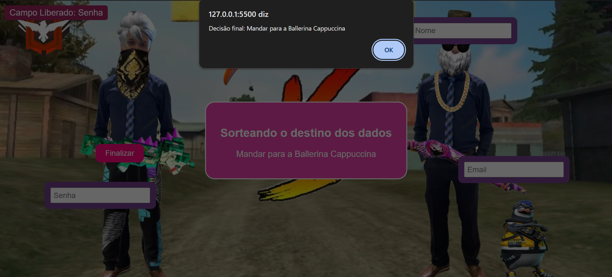

# Formulário Interativo - Atividade de Programação Web

 

Demonstração do site

## Descrição do Projeto

Este projeto consiste em uma página web, criada como uma atividade da matéria de Programação Web. O objetivo da atividade é criar uma página web, mas com humor. Nessa linha de raciocínio, nós desenvolvemos uma página de formulário, no qual o usuário deverá inserir seus dados (como: Nome, Email e Senha).
Entretanto, este não é um simples formulário, os campos de input estão **em movimento** e só podem ser **liberados** se você **mirar e clicar com precisão**. Ao liberar todos os campos, um botão aparecerá para **sortear o destino** dos seus dados.

## Como Funciona?

- O cursor é uma **mira personalizada**.
- Cada campo (`Nome`, `Email`, `Senha`) se move aleatoriamente pela tela.
- Clique nos campos com a mira para "destravar" e preencher.
- Após liberar todos os campos, clique em **Finalizar** para sortear o destino dos seus dados.
- O destino será escolhido aleatoriamente entre opções como:
  - Postar no Twitter
  - Mandar pro Elon Musk
  - Tralalero Tralala
  - Ballerina Cappuccina

**Desenvolvedores**:

- [Ana Maria](https://github.com/soouzaana)
- [Ândrea]
- [Luis Miguel](https://github.com/luiss05)

Criado por estudantes do 2º ano de Informática do IFRO - Ji-Paraná.

Projeto com fins **educacionais e humorísticos**.
